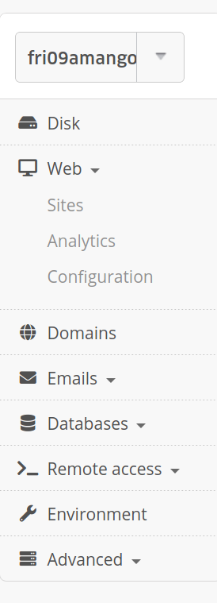
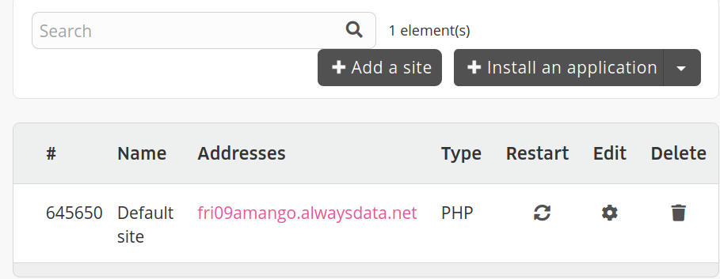
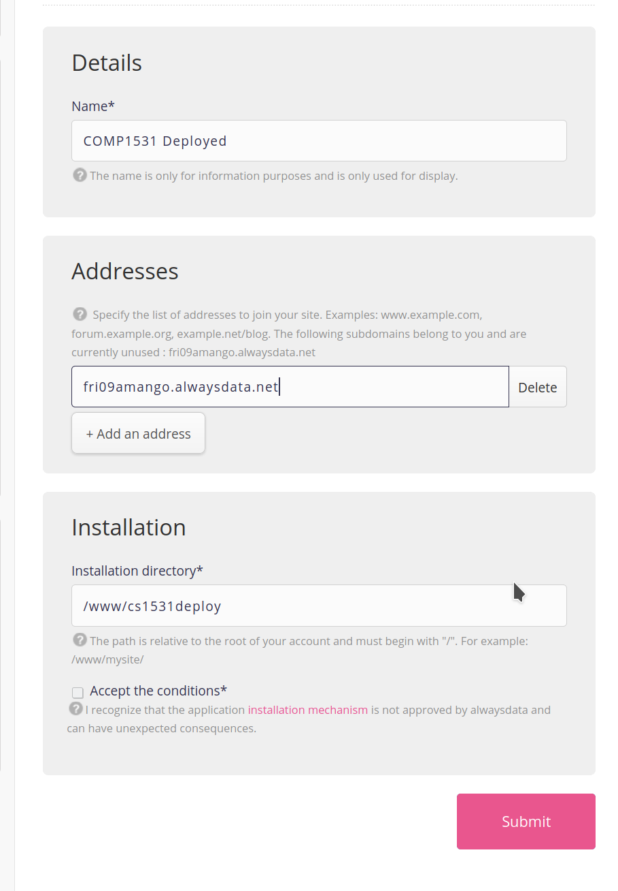
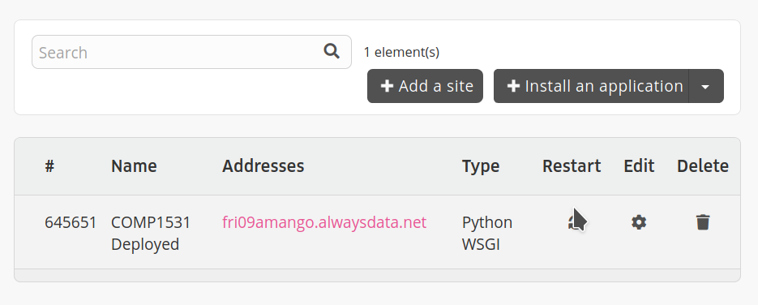
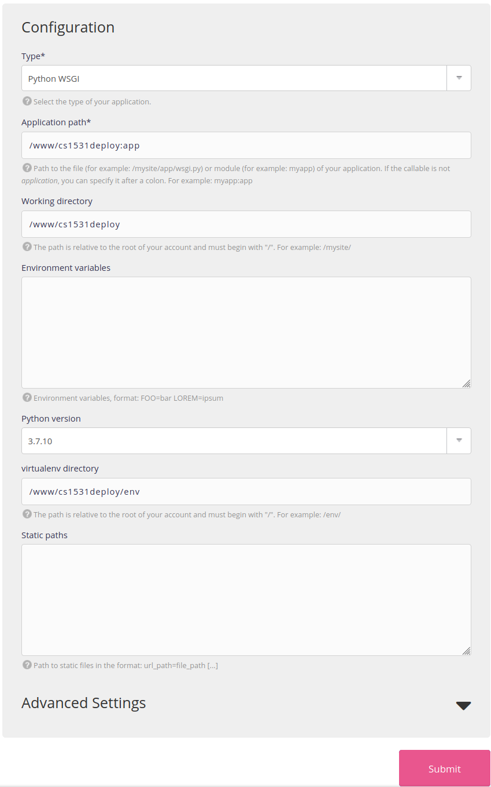
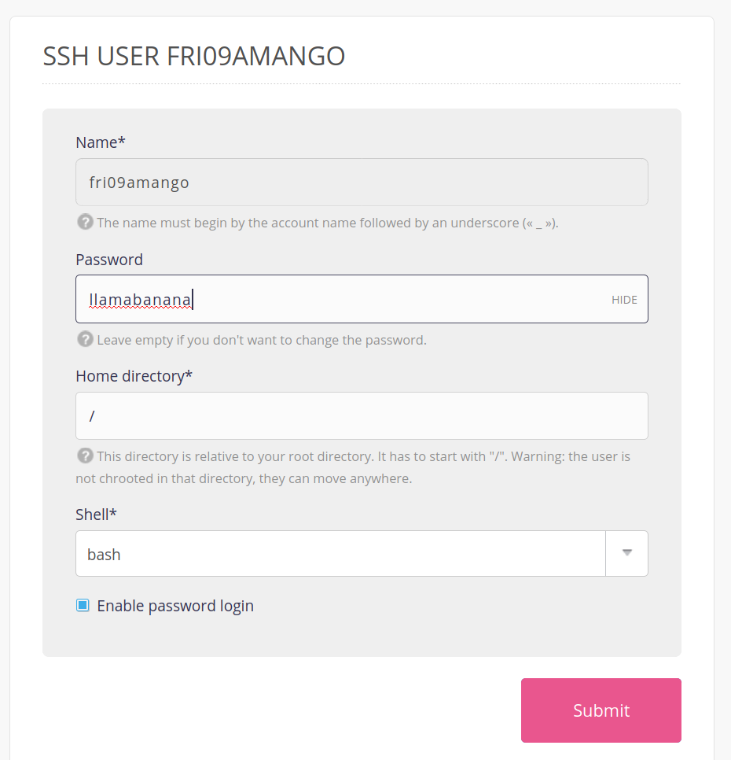
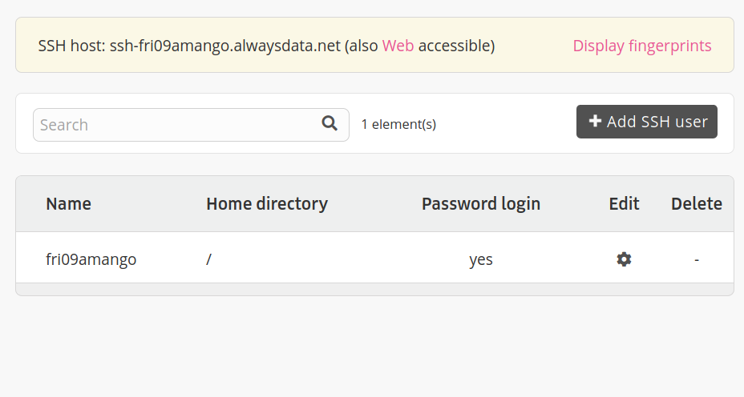
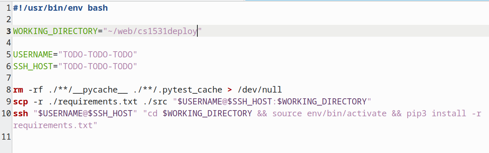
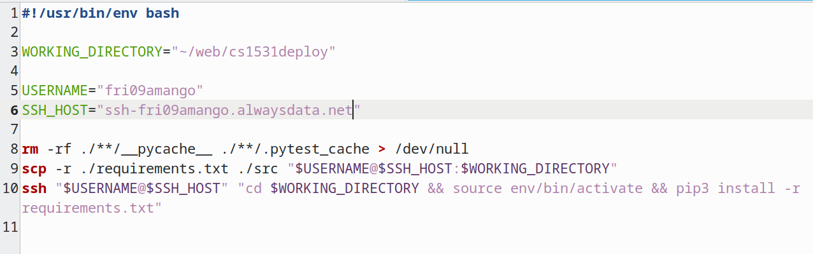

## Deploying with AlwaysData

A video guide of deploying with alwaysdata [can be found here](https://youtu.be/WZL1Cxh_rCA).

### 5.6.1. One-time setup

1. Navigate to https://admin.alwaysdata.com/ and sign up with a new account (one per team is fine). Use a password you're happy both sharing with your team members and being made public on the internet in the worst case. Set your "Account name" as your 1531 group name (e.g. FRI09AMANGO) for simplicity. Don't worry about any of the "Payment" sections, you won't be charged any money.

2. After logging in, in the sidebar click on "Web > Sites" in the sidebar



3. Delete the "Default Site", and then click the "Install an an application" button and choose "Flask"



4. On the details page, choose a name "COMP1531 Deployed", set the address to be the one stated immediately above teh input as "currently unused" (this will be similar to your username), and for installation set it as as /www/cs1531deploy



5. On the "Web > Sites" page go to "Edit" for your one site.



6. Scroll down and change "Application path" to `/www/cs1531deploy/src/server.py:APP` and change the Python version to `3.9.2`. Click submit.



7. Navigate to the "Remote access" tab in the sidebar, and select "SSH". Click on the "edit" button for the one entry that is there.


8. Enter another password (another one you would be feel comfortable if became public in a worse case), and tick the "Enable password login" button.



9. Open `deploy.sh` in your cloned repository. You will need to replace the `TODO-TODO-TODO` with the following:
 * USERNAME: Your username you signed up with (e.g. fri09amango)
 * SSH_HOST: The name of the host at the top of the SSH page (e.g. ssh-fri09amango.alwaysdata.net)





### 5.6.2. For each deployment

Every time you want to deploy the code that is on your local machine, simply run:
```bash
bash deploy.sh
```

This script will deploy the code to AlwaysData. While it's deploying you will be asked to enter your SSH password (determined in step 8) on two occasions.

Once you have done this, navigate back to "Web > Sites" on AlwaysData and click the "Restart" button for your one site.


Then navigate to the URL of that particular site. Now you have your backend running on the internet.

Note: This is only supported on Linux terminals (including VLAB).

## Troubleshooting

Make sure the site settings on alwaysdata are correct. In particular, application path should be /www/cs1531deploy/src/server.py:APP

#### If you get an error `ImportError: no module found named src`

An alternative fix is to:

1. SSH into the remote server

2. Create a file in the root level called `app.py`, containing the following:

```python
from src.server import APP
from src import config

if __name__ == "__main__":
    # If you need to do any data_store setup, import above and do it here
    APP.run(
        port=config.port, debug=config.environment == "development"
    )  # Do not edit this port
```

Replace the application path in the configuration step (Step 6) with the following:

```/www/cs1531deploy/app.py:APP```

#### No file called requirements.txt exists

If when running the deploy.sh script, you get an error telling you that no file called requirements.txt exists, you have to make your own. Copy the course-wide one here (https://www.cse.unsw.edu.au/~cs1531/22T1/requirements.txt) and also copy any additional packages you've used from here (https://www.cse.unsw.edu.au/~cs1531/22T1/requirements-extra.txt).

#### Disk quota exceeded

One common error is ERROR: Could not install packages due to an OSError: [Errno 122] Disk quota exceeded. To fix this, remove packages from your requirements.txt that you aren't using, delete the site on alwaysdata and try again from the 'install an application' step. You can also remove Pillow from your requirements.txt, comment out any imports from that package in your code, and also comment out any code which uses this import, most likely your user_profile_uploadphoto function. Don't comment the whole thing, only comment the code inside the function but leave the function declaration and the return statement so that your import in server.py works correctly. If you keep getting this error, keep removing packages and deleting the site/retrying.

#### Bad Gateway Upstream closed connection unexpectedly

When you try to load your deployed url in the browser, if you get "Bad Gateway Upstream closed connection unexpectedly", ssh into alwaysdata, go into ~/www/cs1531deploy, then run source env/bin/activate and run python3 -m src.server. This should give you some clues as to what the errors are caused by. Note the deploy.sh script only copies across ./requirements.txt ./src from your repo, so if you are importing from any other modules in your repo, you'll have to update line 9 of deploy.sh to add that module. E.g. I had a group with a ./persistence module, so we updated that line to scp -r ./requirements.txt ./src ./persistence "$USERNAME@$SSH_HOST:$WORKING_DIRECTORY".

#### The requested URL was not found on the server.

If loading your deployed url in the browser gives you {"code": 404, "name": "System Error", "message": "<p>The requested URL was not found on the server. If you entered the URL manually please check your spelling and try again.</p>"}, that means it most likely worked (as we have no route defined on the path '/'). To test it further, you can make requests to your url with an API client like ARC or Postman, or try running it with the frontend (instructions in the README.md here https://gitlab.cse.unsw.edu.au/COMP1531/22T1/project-frontend).
